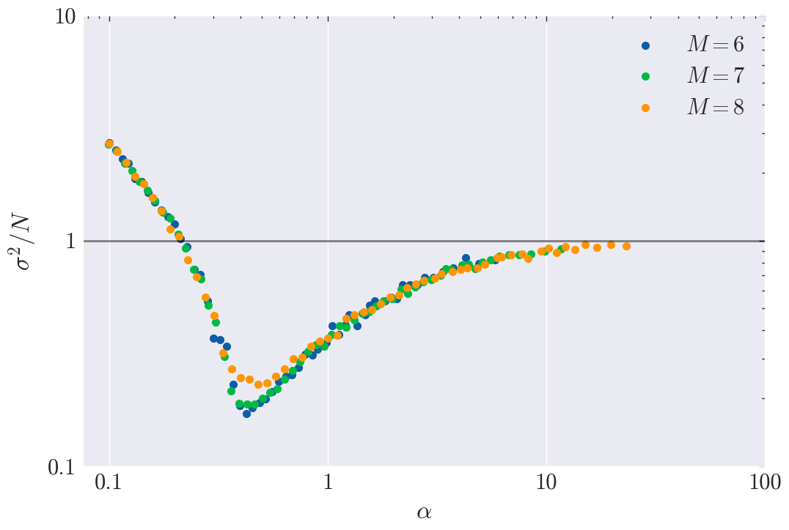

# Self-Organization in the Minority Game

*Long-term volatility $\sigma^2/N$ of the system as a function of the parameter $\alpha=\frac{2^M}{N}$ for various couples $(N,M)$.*

This repository contains the implementation of the Minority Game, which was first introduced by <a href="https://www.sciencedirect.com/science/article/abs/pii/S0378437197004196?via%3Dihub">Challet and Zhang</a>.

## Table of Contents
- [Introduction](#introduction)
- [How to run the code](#how-to-run-the-code)
- [Project report](#project-report)

## Introduction
The Minority Game is a repeated binary prediction game which exhibits emergent behaviors revolving around the idea of *self-organization*. Though the Minority Game can be studied analytically, the methods needed are advanced. Instead, one can use Agent-Based Modeling (ABM) to simulate the game and observe the emergent behaviors. This repository contains an implementation of the Minority Game using the `mesa` library, which is a Python framework for agent-based modeling. The repository essentially allows the user to perform batch simulations and to visualize the results.

## How to run the code
1. This code requires Python 3.12 or higher for compatibility with the `mesa` library.
2. The models are implemented in the `models.py` file, and the agents are implemented in the `agents.py` file.
3. Batch simulations can be run from the command line using the `script_markovian.py` file. The script takes the following arguments:
   - `M`: Memory size
   - `max_steps`: Number of steps
    - `iterations`: Number of simulations for each parameter set

Note that `N` doesn't need to be specified as it is set depending on `M` to generate a log-spaced range of values for `alpha` (the ratio of the number of strategies to the number of agents) from $0.01$ to $100$ using at most $60$ configurations. Note that the computations are run in parallel on all cores by default. The results are saved in the `data/` folder.

4. Once the simulations have been run, they can visualized by running the `save_figures.py` file which will automatically create all plots and save them in the `figures/` folder. For custom plots, the `utils.py` file can be used.

## Project report
The report is available in the `report/` folder. It is structured in four parts:
1. Introduction
2. Presentation of the system
3. Self-organization
4. Financial markets and the Minority Game

In particular, the report contains detailed explanations of the model, the results obtained, and the conclusions drawn from the simulations. The figures used in the report were generated using the `save_figures.py` file and are saved in the `figures/` folder.
